# ExpressLane — v1.2.1

**The fast path inside Oracle.**

**Get started:** [Overview](#overview) · [Features](#features) · [Quick Start](#quick-start) · [Prerequisites](#prerequisites) · [OCM Prerequisites](#ocm-prerequisites) · [OCI Setup](#oci-setup) · [Installation](#installation)

**Use and contribute:** [First Login & Setup](#first-login--setup) · [How to Use ExpressLane](#how-to-use-expresslane) · [FAQ](#faq) · [Support](#support) · [Contributing](#contributing) · [Security](#security) · [Appendix](#appendix--setting-up-ocm-prerequisites) · [License](#license)

---

## Overview

ExpressLane is a streamlined migration and management interface for **Oracle Cloud Migrations (OCM)**. It gives you a simple, guided UI for moving virtual machines from VMware vSphere and AWS EC2 into Oracle Cloud Infrastructure (OCI) — and adds a Cloud Bridge **inventory audit** tool so you can analyze your environment before the first VM ever moves.

Under the hood, ExpressLane is a Flask application that calls the OCI SDK on your behalf. It authenticates to OCI with **Instance Principals**, so there are no API keys, config files, or secrets to manage on the compute instance running the app. You install it once, point it at a compartment, and start migrating.

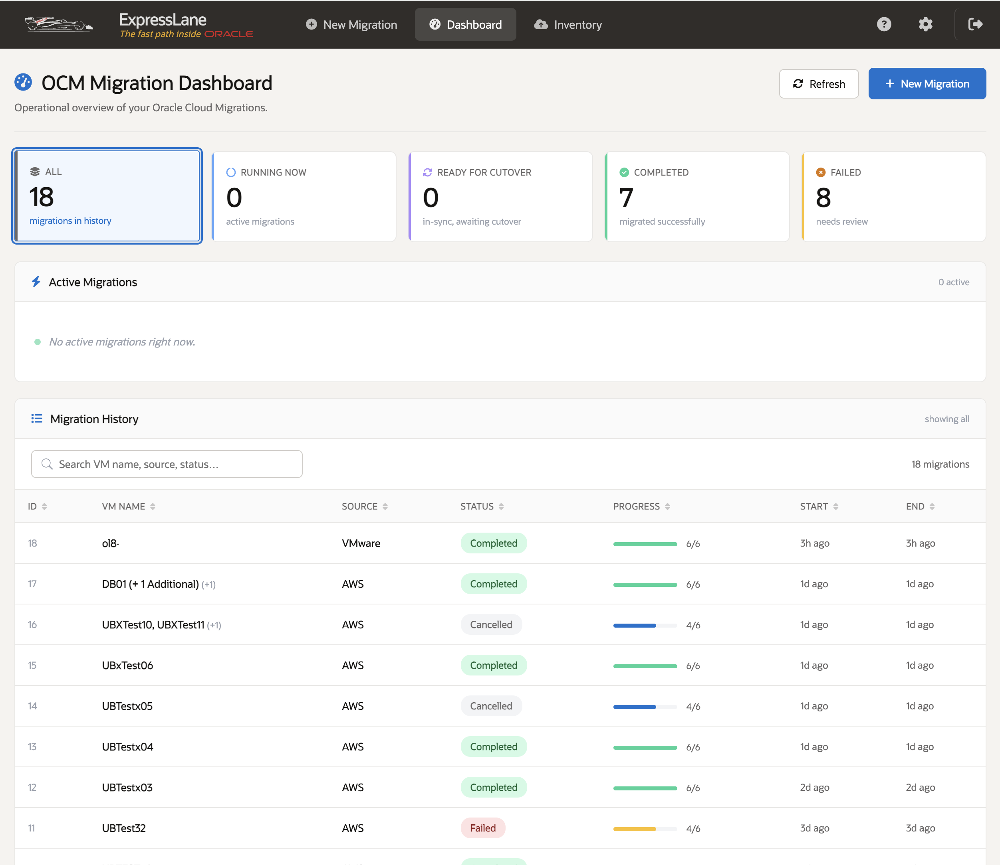

---

## Features

- **VMware and AWS to OCI migrations** — orchestrates the full Oracle Cloud Migrations pipeline from discovery to cut-over.
- **Cloud Bridge inventory audit** — discover and score your existing estate with complexity analysis, zombie detection, and CSV/PDF export.
- **Guided setup wizard** — three screens, no OCIDs typed by hand (everything is picked from live dropdowns).
- **Batch migrations** — kick off many VMs in parallel from a single screen.
- **Live monitoring** — each migration exposes the six-step OCM pipeline with real-time logs, polling, and status.
- **Configurable migration defaults** — default shape, OCPUs, memory, VCN, subnet, and replication bucket, editable at any time.
- **Instance Principals authentication** — no API keys to rotate; no `~/.oci/config` to babysit.
- **Two install paths** — a five-minute manual install on a VM, or a fully containerized Podman deployment on Oracle Linux 9.
- **Runs on any OCI region** — region and compartment are chosen at setup time.
- **UPL-1.0 licensed, Oracle-backed** — free to use, modify, and redistribute.

---

## Quick Start

ExpressLane ships with **two supported installation paths**. Both produce the same application; pick whichever matches your operational preferences.

| I want to…                                              | Use this path                                        |
|---------------------------------------------------------|------------------------------------------------------|
| …get up and running fastest on a fresh OCI VM           | [Option 1 — VM Manual Install](#option-1--vm-manual-install)   |
| …run everything in containers with a reverse-proxied TLS | [Option 2 — Podman Install](#option-2--podman-install)         |

> **Security note:** ExpressLane has **no default admin password** — you will create it the first time you open the app. Do that immediately and do not leave the instance exposed to the public internet with an unset admin password. **TLS is first-class on both install paths:** the VM installer takes `--fqdn`, `--tls-cert`, and `--tls-key` arguments; the Docker stack has a one-file nginx cert swap. See [First Login & Setup](#first-login--setup) for password details and the install steps below for HTTPS.

---

## Prerequisites

Whichever install path you pick, you need all of the following before you start:

- **An active OCI tenancy** with administrator access (or sufficient privileges to create dynamic groups and IAM policies in the root compartment).
- **A compartment** in which ExpressLane will live and where your migration destinations (VCNs, subnets, compute) will be created. A compartment named `Migration` is a common convention — use any name you like.
- **An SSH key pair** for connecting to the compute instance that hosts ExpressLane.
- **Your public IP address or a trusted CIDR range** — used to scope the ingress rule on the VCN security list. Avoid `0.0.0.0/0` unless you have a specific reason.
- **A web browser** on the workstation you will use to complete the setup wizard.
- **For Podman installs only:** a fresh Oracle Linux 9 instance. Podman itself is in the default OL9 AppStream repo; `podman-compose` is installed via pip. The install guide walks you through both.

You do **not** need OCI API keys, `~/.oci/config`, or any secrets on the ExpressLane host. Authentication happens through Instance Principals once the dynamic group and policies are in place.

---

## OCM Prerequisites

ExpressLane is a user interface on top of **Oracle Cloud Migrations (OCM)** and Oracle Cloud Bridge. It does not set those services up for you — before you install ExpressLane, your tenancy needs OCM enabled and at least one Cloud Bridge asset source pointing at a source environment (AWS or VMware). If any of these are missing, ExpressLane will install and run cleanly, but the Inventory page will be empty and the migration builder will have nothing to migrate.

At a minimum, you need all of the following in place **before you run the ExpressLane installer**:

- **OCM root prerequisite stack deployed** — creates the `Migration` and `MigrationSecrets` working compartments, the service policies, and (optionally) the `ocm_replication` Object Storage bucket.
- **A Cloud Bridge Inventory** — one per region, created once.
- **At least one Cloud Bridge Asset Source** — for either **AWS EC2** or **VMware vSphere** (or both). Each asset source needs its own Remote Connections source environment and discovery credentials.
- **A replication bucket** in Object Storage — where OCM stages replicated disk images. Usually created by the prerequisite stack as `ocm_replication`.

**Authoritative Oracle documentation:** <https://docs.oracle.com/en-us/iaas/Content/cloud-migration/home.htm>

**Step-by-step walkthroughs** for the two sub-tasks most people need are in the appendix at the bottom of this README:

- [A.1 — Deploying the OCM Root Prerequisite Stack](#a1--deploying-the-ocm-root-prerequisite-stack)
- [A.2 — Creating an AWS Cloud Bridge Asset Source](#a2--creating-an-aws-cloud-bridge-asset-source)

For VMware source environments, follow the same pattern as the AWS walkthrough but select **VMware** at the asset source type picker. The full VMware-specific setup (vCenter endpoint, credentials, Remote Agent Appliance, Agent Dependencies) is documented in detail in the [Oracle Cloud Migrations documentation](https://docs.oracle.com/en-us/iaas/Content/cloud-migration/home.htm) under the **Remote Agent Appliances**, **Source Environments**, and **Agent Dependencies** sections.

> **Already have OCM and a working asset source?** You can skip this section. Confirm in the OCI Console that **Migration & Disaster Recovery → Migrations → Inventory** shows your existing asset source and that it has discovered at least one VM — that's all ExpressLane needs.

---

## OCI Setup

These steps are **common to both install options** below. They give you a networked compute instance with IAM permissions to call OCI services on your behalf via Instance Principals — meaning you never need to drop API keys or `~/.oci/config` on the host.

Skip to [Installation](#installation) once you've completed all five sub-steps here.

### 1. Create a Virtual Cloud Network (VCN)

1. In the OCI Console, go to **Networking → Virtual Cloud Networks**.
2. Click **Start VCN Wizard**, choose **Create VCN with Internet Connectivity**, and name the VCN `VCN`.
3. After the wizard finishes, open **Security → Security Lists** and select the **Default Security List for VCN**.
4. Add an **Ingress Rule** on **TCP 80** scoped to your public IP (`x.x.x.x/32`) or a trusted CIDR range. **If you plan to enable HTTPS**, also add an ingress rule for **TCP 443**.

> **Security note:** avoid leaving port 80 or 443 open to `0.0.0.0/0` unless you explicitly need public reach. ExpressLane rate-limits the `/login` and `/setup` POST endpoints to 10 attempts per IP per minute and protects the rest of the app behind a required admin session, but scoping ingress to known networks is still the right default for anything beyond a public demo.

### 2. Create a Compute Instance

1. Navigate to **Compute → Instances → Create Instance**.
2. **Name:** `ExpressLaneApp`
3. **Image:** Oracle Linux 9 (latest platform image)
4. **Shape:** `VM.Standard.E6.Flex` (or `E4.Flex` / `E5.Flex` — any AMD flex shape works).
   - For **Option 1 (VM Manual Install)**: 1 OCPU / 11 GB RAM is more than enough.
   - For **Option 2 (Podman Install)**: 2 OCPU / 16 GB RAM gives the container stack some headroom.
5. **Network:** the VCN you just created, in the public subnet.
6. **SSH keys:** paste your public key.
7. Click **Create**.

When the instance is running, open it and **copy its OCID** — you'll paste it into the dynamic group in the next step.

### 3. Open the Host Firewall (only if `firewalld` is active)

OCI Oracle Linux 9 platform images have varied over time on whether `firewalld` is enabled by default. Check first, and only run the open-port commands if it is actually running.

SSH to the instance and check:

```bash
ssh opc@<PUBLIC_IP>
sudo systemctl is-active firewalld
```

- **If it prints `active`**, open HTTP and HTTPS:
  ```bash
  sudo firewall-cmd --permanent --add-service=http
  sudo firewall-cmd --permanent --add-service=https
  sudo firewall-cmd --reload
  ```
- **If it prints `inactive` or `unknown`**, skip this sub-step — the host firewall is not enforcing anything and the OCI security list ingress rule from sub-step 1 is the only layer you need.

Note that the VM installer (`deploy.sh` in Option 1) also runs `firewall-cmd --add-service=http/https` when it detects `firewalld` is active, so this sub-step is optional for Option 1. It is more important for Option 2 (Podman), where nothing else is going to open the firewall for you.

### 4. Create the Dynamic Group

ExpressLane authenticates to OCI via Instance Principals, which requires (a) a dynamic group that matches your compute instance and (b) a policy granting that dynamic group permissions.

1. In the OCI Console, go to **Identity & Security → Domains → Default domain → Dynamic Groups → Create Dynamic Group**.
2. **Name:** `expresslane-dg`
3. **Description:** `ExpressLane VM Migrator compute instance`
4. **Matching Rule:** select **Match any rules below** and add:
   ```
   Any {instance.id = 'ocid1.instance.oc1.<REGION>.<UNIQUE_ID>'}
   ```
   Replace the placeholder OCID with the actual instance OCID you copied in sub-step 2.
5. Click **Create**.

### 5. Create the IAM Policy

1. In the OCI Console, go to **Identity & Security → Policies → Create Policy**.
2. Ensure you are in the **root compartment** (select it from the compartment picker on the left). Tenancy-scoped policies must live in the root.
3. **Name:** `expresslane-policy`
4. **Description:** `Permissions for ExpressLane VM Migrator`
5. Switch to the **Manual Editor** and paste all fifteen statements verbatim:

```
Allow dynamic-group expresslane-dg to manage ocm-migration-family in tenancy
Allow dynamic-group expresslane-dg to manage ocb-asset-sources in tenancy
Allow dynamic-group expresslane-dg to manage ocb-asset-source-connectors in tenancy
Allow dynamic-group expresslane-dg to manage ocb-connectors in tenancy
Allow dynamic-group expresslane-dg to manage ocb-inventory in tenancy
Allow dynamic-group expresslane-dg to manage ocb-inventory-asset in tenancy
Allow dynamic-group expresslane-dg to manage ocb-workrequests in tenancy
Allow dynamic-group expresslane-dg to manage orm-family in tenancy
Allow dynamic-group expresslane-dg to manage instance-family in tenancy
Allow dynamic-group expresslane-dg to manage volume-family in tenancy
Allow dynamic-group expresslane-dg to use virtual-network-family in tenancy
Allow dynamic-group expresslane-dg to use object-family in tenancy
Allow dynamic-group expresslane-dg to inspect compartments in tenancy
Allow dynamic-group expresslane-dg to inspect tenancies in tenancy
Allow dynamic-group expresslane-dg to use tag-namespaces in tenancy
```

6. Click **Create**.

**What each policy statement unlocks:**

| Statement                                                   | Why it's needed                                                             |
|-------------------------------------------------------------|-----------------------------------------------------------------------------|
| `manage ocm-migration-family`                               | Create, update, execute, and delete OCM migrations, plans, and assets.      |
| `manage ocb-asset-sources`                                  | Create and update Cloud Bridge asset sources (VMware, AWS).                 |
| `manage ocb-asset-source-connectors`                        | Refresh and manage asset source connectors.                                 |
| `manage ocb-connectors`                                     | Access Cloud Bridge connectors.                                             |
| `manage ocb-inventory`                                      | List and manage Cloud Bridge inventories.                                   |
| `manage ocb-inventory-asset`                                | Read and manage individual inventory assets (VMs).                          |
| `manage ocb-workrequests`                                   | Observe and cancel Cloud Bridge work requests.                              |
| `manage orm-family`                                         | Create Resource Manager stacks and jobs for destination infrastructure.     |
| `manage instance-family`                                    | Create, start, stop, and terminate compute instances in the destination.   |
| `manage volume-family`                                      | Attach, detach, and resize block volumes during migration.                  |
| `use virtual-network-family`                                | List and attach VCNs, subnets, NSGs, and VNICs during destination build-out.|
| `use object-family`                                         | Read and write to replication buckets during OCM asset staging.             |
| `inspect compartments`                                      | Enumerate compartment names for the compartment picker.                     |
| `inspect tenancies`                                         | Read tenancy metadata (home region, name).                                  |
| `use tag-namespaces`                                        | Apply defined tags to resources created during migration.                   |

> **Why tenancy-scoped?** ExpressLane lets users pick VCNs, subnets, buckets, and compartments interactively from anywhere in the tenancy. The `in tenancy` clauses let the app enumerate those resources regardless of which compartment they live in. If you need to lock ExpressLane to a single compartment, replace `in tenancy` with `in compartment <name>` — but you will lose the ability to migrate to other compartments from the UI.

> **Important:** IAM policies take **two to three minutes to propagate** globally. If ExpressLane's first API call after install fails with `NotAuthorized`, wait a couple of minutes and retry — do not start editing policies until you have given them time to apply.

---

## Installation

Pick the install path that matches your operational preferences. Both produce the same application. Both assume you've completed [OCI Setup](#oci-setup) above.

### Option 1 — VM Manual Install

This is the fastest way to get ExpressLane running. Once the OCI setup above is done, the install itself takes about five minutes on a fresh Oracle Linux 9 instance.

#### Step 1. Install the Application

On the ExpressLane compute instance (SSH in as `opc` if you haven't already), download the release zip and run the installer:

```bash
curl -LO https://github.com/oracle-quickstart/expresslane/releases/latest/download/expresslane.zip
unzip expresslane.zip
cd expresslane/deploy
```

You have two choices for how to run the installer:

**Option A — plain HTTP (fastest, for lab and evaluation):**

```bash
sudo bash deploy.sh
```

The installer writes the systemd unit, installs an nginx reverse-proxy config that listens on port 80, opens port 80 in firewalld, and starts the service. When it finishes it prints the **external IP address** of the instance — open `http://<external-ip>/` in your browser.

**Option B — HTTPS with your own TLS cert (recommended for anything beyond a lab):**

Upload your TLS certificate chain and private key to the instance first, then pass them to the installer along with the FQDN that the cert was issued for:

```bash
sudo bash deploy.sh \
    --fqdn       expresslane.example.com \
    --tls-cert   /home/opc/fullchain.pem \
    --tls-key    /home/opc/privkey.pem
```

The installer will:

- Copy the cert to `/etc/pki/tls/expresslane/fullchain.pem` (mode 0644) and the key to `/etc/pki/tls/expresslane/privkey.pem` (mode 0600).
- Render `nginx-expresslane-ssl.conf` with your FQDN and install it as the live nginx config. The SSL config redirects plain HTTP to HTTPS, so port 80 stays open for the redirect.
- Inject `Environment="SECURE_COOKIES=true"` into the systemd unit so ExpressLane only issues Secure cookies.
- Open both ports 80 and 443 in firewalld.
- Print `https://<your-fqdn>/` as the URL to open.

> **Before you run Option B, make sure DNS for your FQDN already points at the instance's public IP.** If DNS is not ready yet, run Option A first, set up DNS, and then re-run Option B — `deploy.sh` is idempotent and will upgrade the running stack in place.

> **Certificate sources:** any standard PEM chain works — Let's Encrypt (`certbot`), an internal CA, or a purchased cert. `fullchain.pem` must contain your leaf cert *and* the issuing chain in that order; `privkey.pem` must be the unencrypted private key.

> **Security note:** `SECURE_COOKIES=true` is automatically set when you use Option B. Do **not** mix it with a plain-HTTP install — the browser will refuse to send the session cookie and you'll get an infinite login loop.

#### Step 2. Verify the Service

Before you open the browser, confirm the systemd service started cleanly:

```bash
sudo systemctl status expresslane
```

You should see `active (running)`. If it is not running, tail the logs:

```bash
sudo journalctl -u expresslane --since "5 min ago"
```

Log locations to know for day-two operations:

| What              | Where                                                   |
|-------------------|---------------------------------------------------------|
| Systemd service   | `journalctl -u expresslane`                             |
| Gunicorn          | `/opt/expresslane/gunicorn.log`                         |
| nginx access/err  | `/var/log/nginx/access.log`, `/var/log/nginx/error.log` |
| App config        | `/opt/expresslane/config.json`                          |
| SQLite DB         | `/opt/expresslane/instance/expresslane.db`              |

To back up ExpressLane, copy `/opt/expresslane/config.json` and `/opt/expresslane/instance/`. Everything else can be rebuilt by re-running the installer.

---

### Option 2 — Podman Install

This path runs ExpressLane as two containers (`expresslane-app` and `expresslane-nginx`) on a fresh Oracle Linux 9 instance using **Podman**, Oracle Linux's native container runtime. You get cleaner isolation, a built-in reverse proxy, and no host daemon to manage.

**One command, HTTP:**

```bash
ssh opc@<public-ip>
curl -LO https://github.com/oracle-quickstart/expresslane/releases/latest/download/expresslane.zip
unzip expresslane.zip
cd expresslane
sudo bash deploy/podman-deploy.sh
```

**One command, HTTPS** (bring your own cert):

```bash
sudo bash deploy/podman-deploy.sh \
    --fqdn expresslane.example.com \
    --tls-cert /path/to/fullchain.pem \
    --tls-key  /path/to/privkey.pem
```

The installer checks for `podman` and `podman-compose` (installs them if missing), seeds `config.json` + `.env`, fixes runtime directory ownership, builds the image, starts the stack, waits for the healthcheck, and prints the URL to open in your browser. It is idempotent — re-run it to upgrade in place.

You should finish looking at something like:

```
================================================
  ExpressLane v1.2.1 — Installation Complete!
================================================

  ExpressLane app: RUNNING (healthy)
  nginx:           RUNNING

  Internal:  http://10.0.0.87/
  External:  http://<public-ip>/

  Logs:      sudo podman logs -f expresslane-app
  Restart:   sudo podman-compose restart app
  Uninstall: sudo podman-compose down
================================================
```

Open `http://<public-ip>/` in a browser — it will redirect to the setup wizard.

#### Common Commands

```bash
# View live logs (Ctrl+C to exit)
sudo podman logs -f expresslane-app
sudo podman logs -f expresslane-nginx

# Restart just the app after editing config.json or ~/.oci
sudo podman-compose restart app

# Stop and remove containers (state in ./instance and ./cache is preserved)
sudo podman-compose down

# Rebuild the image after updating source files
sudo podman-compose build app
sudo podman-compose up -d
```

| Path                              | Contents                                         |
|-----------------------------------|--------------------------------------------------|
| `~/expresslane/config.json`   | Setup wizard output — **back this up**           |
| `~/expresslane/instance/`     | SQLite DB of migration state — **back this up**  |
| `~/expresslane/cache/`        | Inventory cache (safe to delete)                 |
| `~/expresslane/certs/`        | TLS cert material (HTTPS opt-in)                 |

---

## First Login & Setup

The first time you open ExpressLane in a browser, you are redirected to `/setup`. The setup wizard has **three short screens** and takes about ninety seconds once your IAM setup has propagated.

### Step 1 — Create the Admin Account and Verify Instance Principals

Pick a **username** and a **strong password** for the local admin account. This account is stored locally in the ExpressLane database; it is not an OCI IAM user.

Once the admin account is created, the wizard checks whether Instance Principals are working by calling the OCI metadata service. You should see **"Instance Principals Detected"** — that is the confirmation that your dynamic group + policy combo is correct and that ExpressLane can talk to OCI on this instance's behalf.

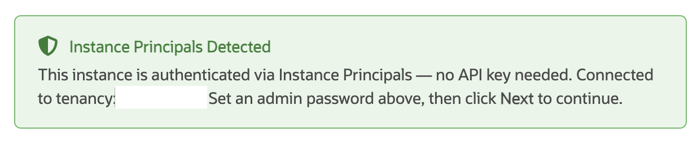

> **Security note:** **change this admin password anytime you suspect it has leaked.** The local admin is the only credential protecting access to the app — treat it like a root password for the ExpressLane host. Do not reuse passwords across environments, and do not commit the generated `config.json` to source control.

### Step 2 — Environment

Pick the **OCI region** and **Migration compartment** you want ExpressLane to operate in. Both fields are live dropdowns populated from your tenancy, so there are no OCIDs to copy and paste. The wizard remembers these choices in `config.json`; you can change them later from the Settings page.

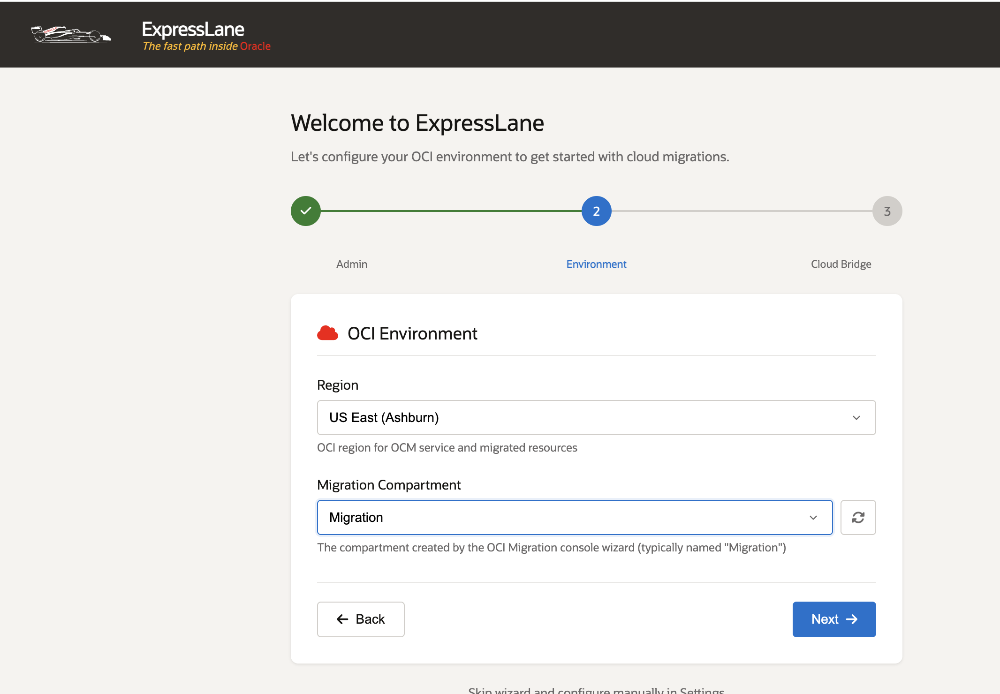

### Step 3 — Cloud Bridge

Point ExpressLane at your existing **Cloud Bridge Asset Source** (for AWS or VMware discovery) and the **Replication Bucket** that OCM will use to stage disk images. Both are dropdowns — if you don't see your asset source in the list, go to the OCI Console and make sure the asset source exists in the selected compartment.

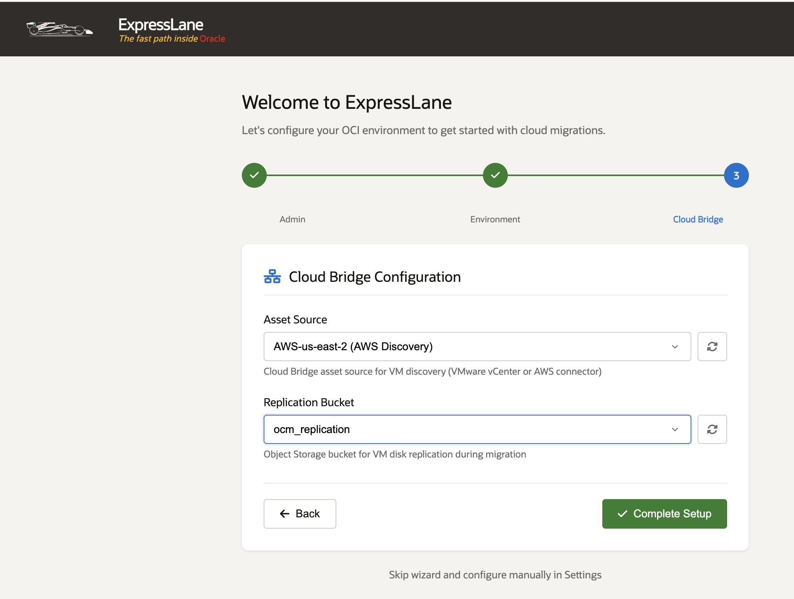

When you click **Complete Setup**, ExpressLane writes `config.json` to disk and lands you on the OCM Dashboard. You are ready to migrate.

---

## How to Use ExpressLane

**In this section:** [Dashboard](#the-ocm-dashboard) · [Inventory](#inventory) · [Starting a Migration](#starting-a-migration) · [Migration Plan & Scheduling](#migration-plan-and-scheduling) · [Monitoring](#monitoring-a-running-migration) · [Test Migrations](#testing-a-warm-migration-before-cutover) · [Batch Migrations](#batch-migrations) · [Settings](#settings)

### The OCM Dashboard

The dashboard at `/dashboard` is the single pane of glass for everything going on. The KPI cards at the top show totals (total migrations, running, completed, failed), and the Migration History table lists every migration you have started — filtered, searchable, and sortable.


### Inventory

The Inventory page at `/inventory` is the Cloud Bridge audit view. It lists every asset discovered by the asset source you configured in the setup wizard, rolled up with totals for **vCPU, RAM, and storage**. You can export the whole thing as CSV or PDF for pre-migration planning.

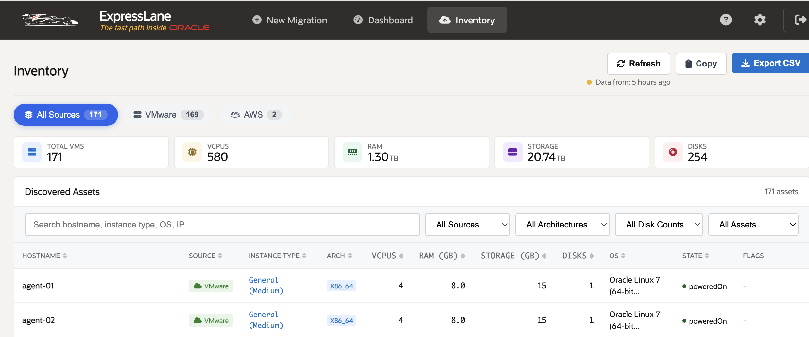

### Starting a Migration

Click **Start New OCM Migration** on the dashboard (or navigate to `/ocm`) to open the migration builder. Pick the source VMs from the inventory list, choose the destination compartment, VCN, and subnet, and ExpressLane assembles the Oracle Cloud Migrations payload.

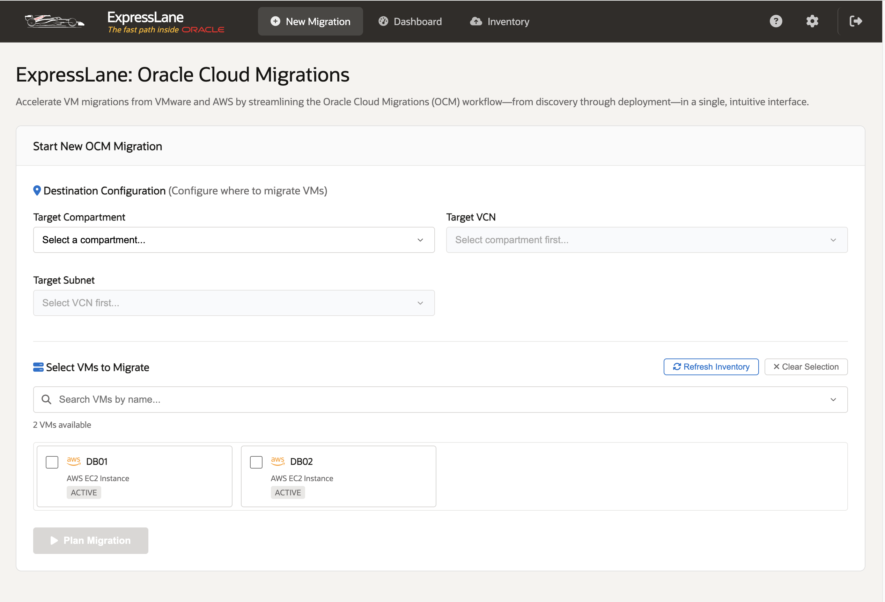

### Migration Plan and Scheduling

Each VM gets a migration plan with a configuration matrix (shape, OCPUs, memory, disks, network) and a schedule picker. ExpressLane supports **Migrate Immediately**, **Run Once & Pause**, and **Warm Migration** variants.

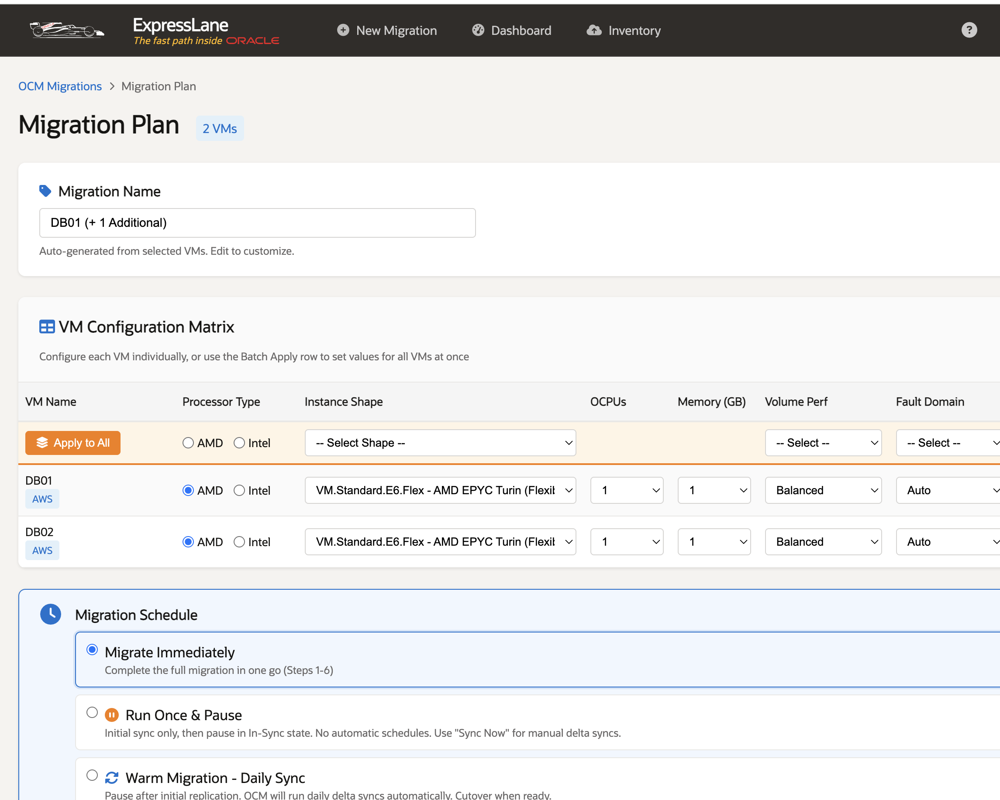

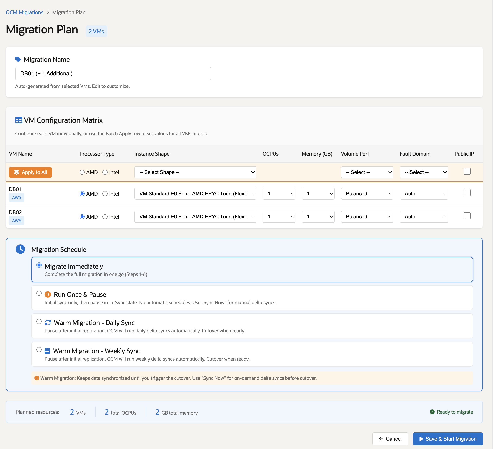

For scheduled runs, pick the start time and timezone — ExpressLane honors the timezone on the application host, so set it explicitly if your instance's clock is UTC.

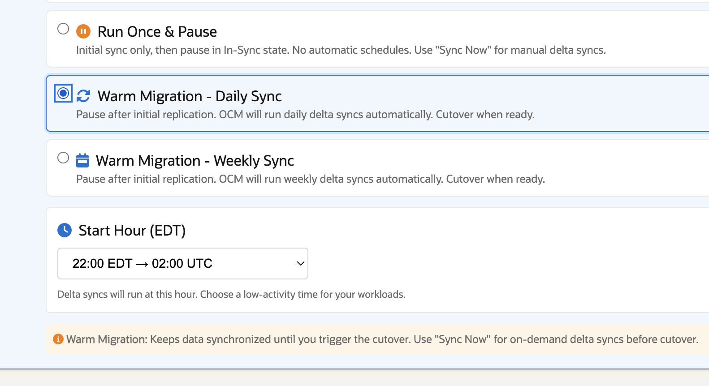

> **Timezone gotcha:** the default clock on a fresh OL9 instance is UTC. If you schedule `09:00` expecting local time, you'll get 09:00 UTC. Set the instance timezone explicitly with `timedatectl set-timezone <your-zone>` before scheduling.

### Monitoring a Running Migration

Click into any migration to see the **six-step OCM pipeline** (Create Project → Create Plan → Add Asset → Replicate Asset → Generate RMS Stack → Deploy Stack), along with live logs, polling status, and step-level retry.

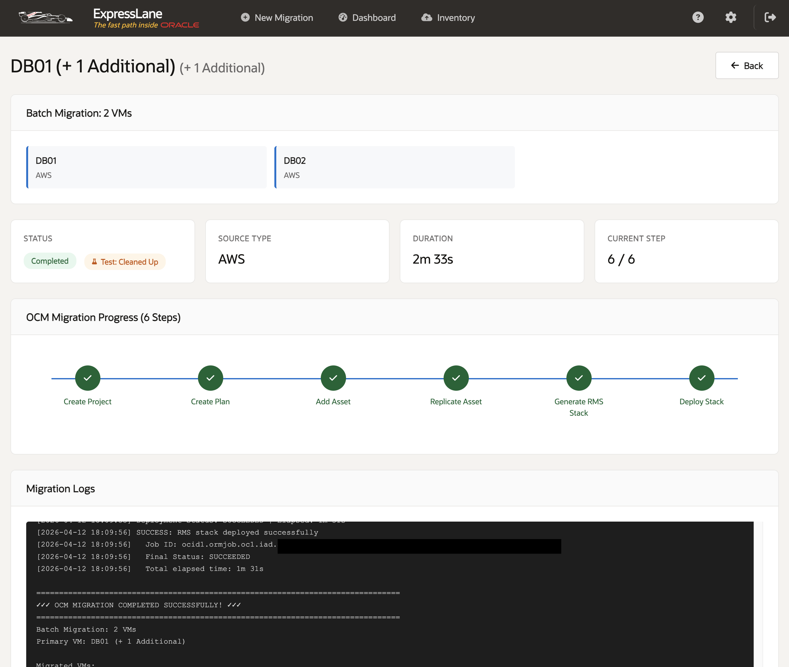

For a VMware-sourced migration in mid-flight, the detail page shows exactly which step is running and what the SDK is doing at that moment:

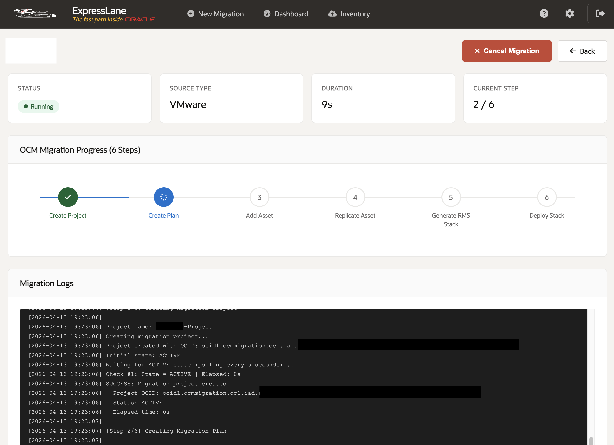

Expanding a step surfaces the full SDK log stream for that step — useful when you need to debug a stuck Create Plan or Replicate call. If a step fails, a **Retry** button re-runs that step in place without restarting the whole pipeline.

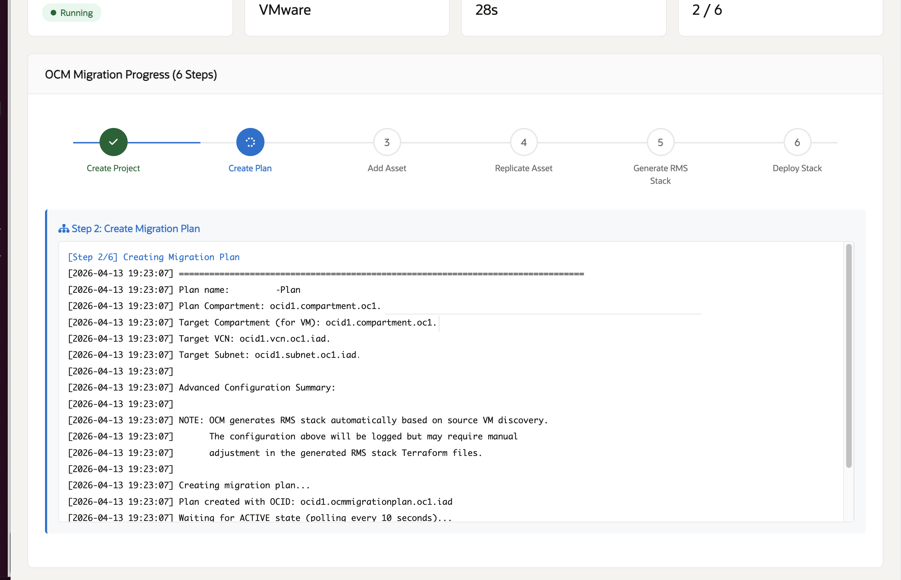

### Testing a Warm Migration Before Cutover

When you picked **Warm Migration — Daily Sync** or **Weekly Sync** back in the schedule picker, the migration doesn't cut over automatically. Instead, after the initial replication finishes, the migration lands in the **In Sync** state and waits for you to decide when to pull the trigger. In this state you get three options in a blue banner at the top of the migration detail page:

- **Sync Now** — run a delta sync against the source, pulling any changes that have happened since the last replication pass. Useful right before a test or cutover so you know you're working with current data.
- **Test Migration** — deploy a throwaway copy of the VM to your destination subnet so you can verify it actually works before committing to the real cutover. This is the feature documented in this section.
- **Cutover Now** — the real cutover. Skip ahead only once you're happy the test migration validates cleanly.

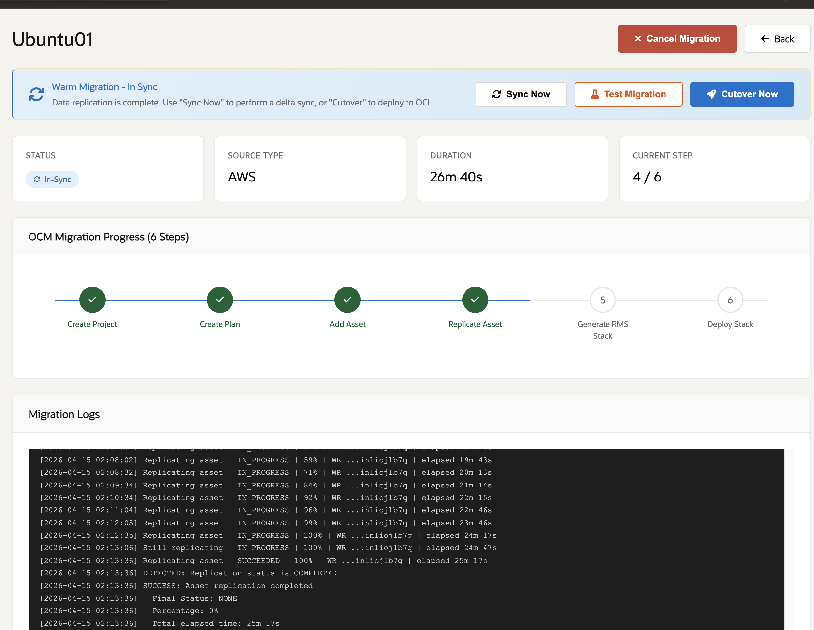

**Why test first?** A test migration deploys the hydrated boot volume to your destination VCN/subnet as a live instance, so you can SSH or RDP in, check that applications start, validate network reachability, confirm DNS, run smoke tests — all without taking the source VM offline. When you're satisfied, you clean the test up and the **boot volume is preserved**, so the eventual real cutover reuses the already-replicated disk instead of replicating from scratch. This shrinks your cutover window dramatically.

#### Step 1 — Kick off the test

From the In Sync banner, click **Test Migration**. ExpressLane runs a separate four-step test pipeline, shown in its own "Test Migration" panel beneath the main six-step OCM pipeline:

1. **Generate Test Stack** — builds a Resource Manager stack that will create the test compute instance alongside a hydrated copy of the replicated boot volume. The original migration's state is left untouched.
2. **Deploy Test VM** — applies the stack. OCI materializes the test instance in the destination subnet you picked during the plan phase. This typically takes a few minutes.
3. **Awaiting Validation** — the pipeline stops and waits for you. At this point the test instance is up and the UI shows a green "Test VM Deployed" banner with a **Clean Up Test VM** button.
4. **Clean Up Test VM** — runs only when you click the button.

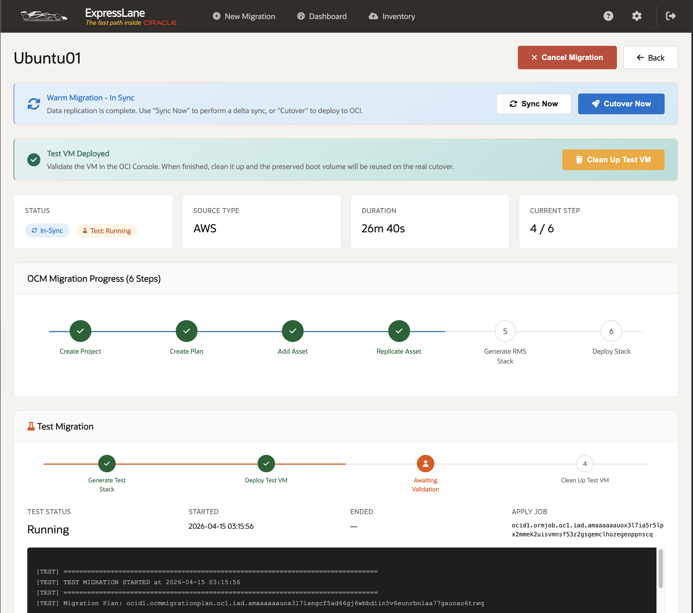

Notice that the **main** 6-step pipeline at the top stays paused at its current step (typically 4/6 — Replicate Asset) for the entire test. Nothing that happens in the test pipeline affects the main migration's progress; you can even run `Sync Now` on the main pipeline while a test is active, and the test VM is unaffected.

#### Step 2 — Validate the VM in the OCI Console

While the test pipeline is in **Awaiting Validation** state, switch over to the OCI Console and find the new compute instance in the destination compartment. Do whatever validation makes sense for your workload:

- SSH or RDP in using the source VM's credentials (they're replicated with the boot volume).
- Check that services start, databases come up, application ports respond.
- Verify network reachability from where your users actually live — not just from inside OCI.
- Check DNS, DHCP, routing, security list ingress rules, NSG attachments.
- Run any smoke tests or health checks you'd normally run after a real migration.

The test VM is a **real, running OCI instance** — you are paying for it while it is up, so don't leave it running indefinitely.

#### Step 3 — Clean up the test VM

When you're satisfied, click **Clean Up Test VM** in the green banner. ExpressLane terminates the test instance but tells OCI to **preserve the hydrated boot volume** (`preserve_boot_volume=True`). The Resource Manager stack and the boot volume are both retained so the eventual real cutover can reuse them.

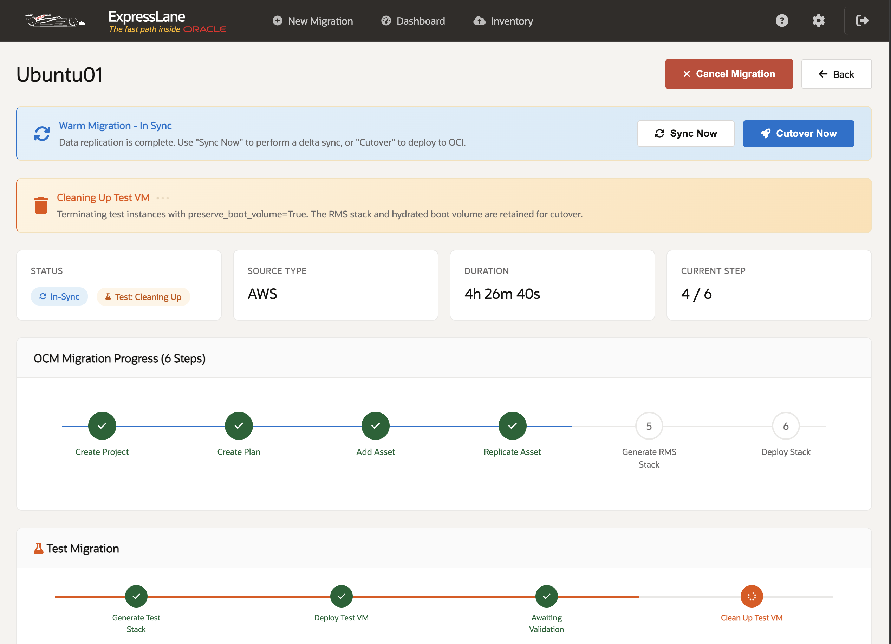

The yellow "Cleaning Up Test VM" banner explains exactly what's happening: *"Terminating test instances with preserve_boot_volume=True. The RMS stack and hydrated boot volume are retained for cutover."* The test pipeline's fourth step advances from pending to active to complete, and the main migration returns to the In Sync state with the Sync Now and Cutover Now buttons available again. (Note that **Test Migration** is no longer offered after the first test — the hydrated boot volume has already been validated.)

#### Step 4 — Do the real cutover

Run **Sync Now** one more time to pull any last-minute changes from the source, then click **Cutover Now** to let the main 6-step OCM pipeline advance through steps 5 (Generate RMS Stack) and 6 (Deploy Stack). Because the boot volume from the test is still hanging around, step 5 reuses it instead of re-replicating — the real cutover typically takes under a minute once you click the button.

> **Test migration cost and cleanup hygiene.** The test VM is billed while it is running. Tests are usually validated in under an hour, but if a test is left in the **Awaiting Validation** state overnight because a reviewer got pulled away, you will pay for that time. If you are running many tests as part of a migration wave, consider putting a calendar reminder on yourself to clean up. Cancelling a test migration from the UI is equivalent to clicking **Clean Up Test VM** — the boot volume is preserved either way.

> **Test migrations are only available on Warm Migration schedules.** If you picked **Migrate Immediately** or **Run Once & Pause**, the In Sync state (and the Test Migration button) never appears. For those schedules you don't get a pre-cutover test — the migration either commits straight through (Immediately) or holds at a pause point that is not a live test VM (Run Once & Pause). If validating with a live test instance is important to you, always pick Warm Migration at plan time.

### Batch Migrations

The builder lets you select **many VMs at once** and commit them as a single batch. The batch shows up on the dashboard as multiple rows (one per VM) with a shared batch identifier so you can filter them together. Batches are useful for waves of similar VMs (e.g. all web tier nodes) and for queueing weekend work with *Run Once & Pause*.

### Settings

Go to `/settings` any time to change the region, Migration compartment, asset source, replication bucket, or polling interval. Changes are written to `config.json` and take effect on the next page load.

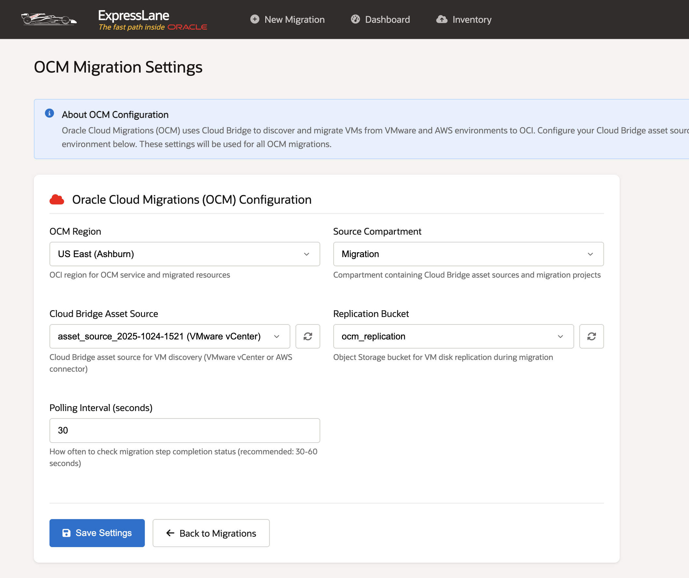

---

## FAQ

**What source clouds does ExpressLane support?**
VMware vSphere and AWS EC2, by way of Oracle Cloud Bridge. Other sources can be plumbed in as Cloud Bridge expands.

**Do I need OCI API keys?**
No. ExpressLane authenticates via Instance Principals — the compute instance hosting the app is matched by a dynamic group, and OCI grants permissions based on the instance's identity. No `~/.oci/config` is required.

**Does ExpressLane ship with HTTPS?**
Yes — both install paths have first-class HTTPS. For the VM install, pass `--fqdn`, `--tls-cert`, and `--tls-key` to `deploy.sh` and it installs the SSL nginx config, enables `SECURE_COOKIES=true`, and opens port 443 automatically. For the Podman install, drop a cert into `certs/`, point `NGINX_CONF` at the SSL config in `.env`, and recreate the stack with `sudo podman-compose up -d`.

**Where is my migration state stored?**
In a SQLite database inside `instance/expresslane.db` on the host. Back up `config.json` + `instance/` to preserve your setup and migration history.

**Which OCI regions are supported?**
Any region you have a tenancy in. The region is picked at setup time and can be changed from the Settings page.

**Does ExpressLane phone home or collect telemetry?**
No. ExpressLane only talks to the OCI APIs you authorized via the dynamic group policy.

**How do I upgrade?**
Grab the new release zip, stop the service (`sudo systemctl stop expresslane` for the VM install or `sudo podman-compose down` for the Podman install), drop in the new files, and restart. Your `config.json` and `instance/` directory are preserved across upgrades because they are not part of the release zip.

**Something isn't working — where do I start?**

- **`NotAuthenticated` in app logs:** the dynamic group matching rule does not match this instance's OCID. Double-check the OCID (watch for trailing whitespace).
- **`NotAuthorized` in app logs:** a policy statement is missing or was created in a sub-compartment. The policy must be in the **root compartment**. And remember: IAM changes take 2–3 minutes to propagate.
- **`PermissionError: config.json` (Podman):** regenerate the `.env` file with `printf 'UID=%s\nGID=%s\n' "$(id -u)" "$(id -g)" > .env` and `sudo podman-compose up -d`.
- **Browser shows the Oracle Linux test page:** a stale host `nginx` is in front of the container stack. `sudo systemctl stop nginx` on the host and hard-refresh.
- **Port 80 works from the instance but not remotely:** open both the OCI security list ingress rule *and* `firewall-cmd --add-service=http --permanent && firewall-cmd --reload`.
- **Browser shows a stale page after a fix:** hard-refresh with `Cmd+Shift+R` / `Ctrl+Shift+R`.

---

## Support

ExpressLane support is split across two channels depending on what kind of issue you are hitting:

### Issues with the ExpressLane application itself

Open a **GitHub issue** at [oracle-quickstart/expresslane/issues](https://github.com/oracle-quickstart/expresslane/issues) for anything that is a problem with the app:

- Install or upgrade failures (`deploy.sh`, Docker/Podman containers, nginx config)
- Setup wizard errors, login problems, session issues
- UI bugs, broken pages, stale data, export problems (CSV/PDF)
- Dynamic group and IAM policy questions *about what ExpressLane requires*
- Feature requests and enhancement ideas

Please include:
- The install path you used (VM manual or Podman).
- Output of `uname -a` and `cat /etc/os-release`.
- The last 100 lines of the app log (`sudo journalctl -u expresslane | tail -100` or `sudo podman logs expresslane-app | tail -100`).
- A clear description of what you were doing and what you expected to happen.

### Issues with a completed migration's destination VM

If a migration **completed successfully in ExpressLane** but you are now having trouble with the destination VM — can't reach it, networking isn't working, the instance won't boot properly, OCI quota or shape issues, block volume problems, anything about the running OCI resources — that is an **Oracle Cloud Infrastructure support issue**, not an ExpressLane issue. Open a ticket with Oracle Support:

**<https://support.oracle.com/>**

Include the destination instance OCID, the source VM name, and the approximate time of the migration so the support engineer can correlate with OCM's work-request history.

### Quick routing table

| Symptom                                                         | Where to go                                     |
|-----------------------------------------------------------------|-------------------------------------------------|
| ExpressLane won't install / won't start / dashboard is broken   | [GitHub Issues](https://github.com/oracle-quickstart/expresslane/issues) |
| Setup wizard errors, admin account problems, login loops       | **GitHub Issues**                                |
| A running migration is stuck on a step in ExpressLane's UI     | **GitHub Issues** first — it may be an app-side retry/polling issue |
| Migration completed, but the destination VM won't boot / is unreachable / has networking trouble | [Oracle Support](https://support.oracle.com/) |
| OCI quota, tenancy, billing, or shape availability issues       | **Oracle Support**                               |
| Cloud Bridge inventory is empty or discovery won't find VMs     | Start with **GitHub Issues**; escalate to **Oracle Support** if it turns out to be an OCM service problem |

---

## Contributing

This project welcomes contributions from the community. Before submitting a pull request, please review [CONTRIBUTING.md](./CONTRIBUTING.md) for the contribution flow, the Oracle Contributor Agreement (OCA) requirement, and the pull-request checklist.

We use GitHub issues for bug reports and feature requests. Please file issues at [oracle-quickstart/expresslane/issues](https://github.com/oracle-quickstart/expresslane/issues).

Pull requests should include:

- A clear description of the change and the motivation.
- Tests or a reproducible manual verification plan.
- An entry in `UPDATING.md` if the change affects existing users.

---

## Security

If you believe you have found a security vulnerability in ExpressLane, please report it privately to **secalert_us@oracle.com**. Do not file public GitHub issues for security-sensitive reports.

We follow Oracle's responsible vulnerability disclosure process. For the full security policy and PGP key information, see [SECURITY.md](./SECURITY.md).

We appreciate your help in keeping Oracle Cloud customers safe.

---

## Appendix — Setting Up OCM Prerequisites

This appendix covers the two OCM configuration tasks that most users need to do once, before running the ExpressLane installer. It is a condensed walkthrough — for the authoritative long-form, see the [Oracle Cloud Migrations documentation](https://docs.oracle.com/en-us/iaas/Content/cloud-migration/home.htm).

If your tenancy already has OCM enabled and a working asset source, you can skip this entire section.

### A.1 — Deploying the OCM Root Prerequisite Stack

This one-time action creates the `Migration` and `MigrationSecrets` working compartments, the service policies OCM needs to operate, and (optionally) an `ocm_replication` Object Storage bucket.

1. In the OCI Console, navigate to **Migration & Disaster Recovery → Migrations**.

   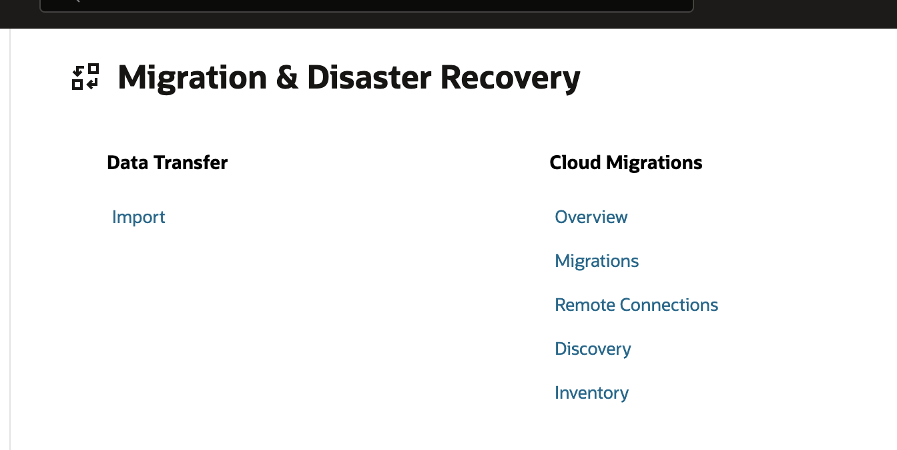

2. In the compartment picker on the left, **select your tenancy's root compartment**. The prerequisite stack must be deployed from the root.

   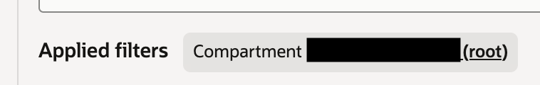

3. Click **Create prerequisites**. This takes you to a pre-populated Resource Manager stack.

   

4. On the **Create Stack** screen, review the defaults and click **Next**.

   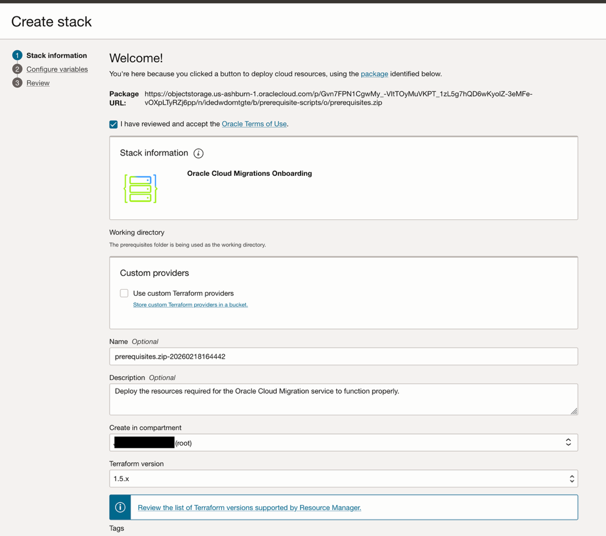

5. On the **Migration Root Location** configuration screen, fill in:
   - **Migration Root Compartment:** select your tenancy's **root** compartment (this is where the `Migration` and `MigrationSecrets` working compartments will be created).
   - **Primary Prerequisite Stack:** leave the default (enabled) unless you have already deployed these resources.
   - **Enabled Migrations:** check **VMware VM Migrations** and/or **AWS EC2 Migrations** depending on which source cloud(s) you intend to migrate from. Check both if you are not sure.
   - **Replication Bucket Name:** leave as `ocm_replication` (default) — or supply the name of an existing bucket.
   - **Create a new replication bucket?** leave checked unless you already have a bucket and supplied its name above.
   - **Optional Resources:** leave defaults on unless you have a specific reason to disable them (migration operator groups, Remote Agent Appliance logging, Hydration Agent logging).

   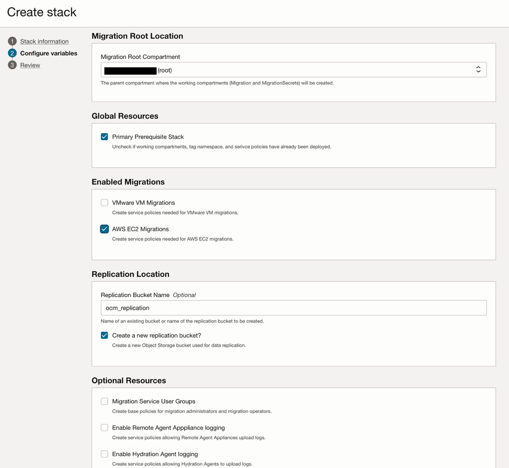

6. Click **Next**, review the plan on the final screen, and click **Create**.

> **Known issue — may need multiple runs.** There is a known bug in the prerequisite stack deployment where the first apply sometimes fails partway through. If the stack ends in a **Failed** state, click **Actions → Edit** and run **Apply** again. Repeat until the stack lands on **Succeeded**. In practice this usually takes **3–5 apply runs** on the first deployment; subsequent upgrades are clean.

When the stack shows **Succeeded**, you will have:

- A `Migration` compartment containing the OCM working resources.
- A `MigrationSecrets` compartment containing a Vault for discovery credentials.
- The `ocm_replication` bucket in Object Storage (unless you supplied an existing one).
- All the IAM policies OCM needs to create migration plans, replicate assets, and materialize destination instances.

---

### A.2 — Creating an AWS Cloud Bridge Asset Source

Once the prerequisite stack has completed, you need to create an **Inventory** and at least one **Asset Source** to give OCM something to discover. These steps cover the AWS path; the VMware path follows the same pattern with different credential inputs.

#### Create the Cloud Bridge Inventory

Inventory is a **regional resource and only one exists per region**, so this is a one-time action. Subsequent asset sources all share the same inventory.

1. Navigate to **Migration & Disaster Recovery → Migrations → Inventory** and click **Create inventory**.

   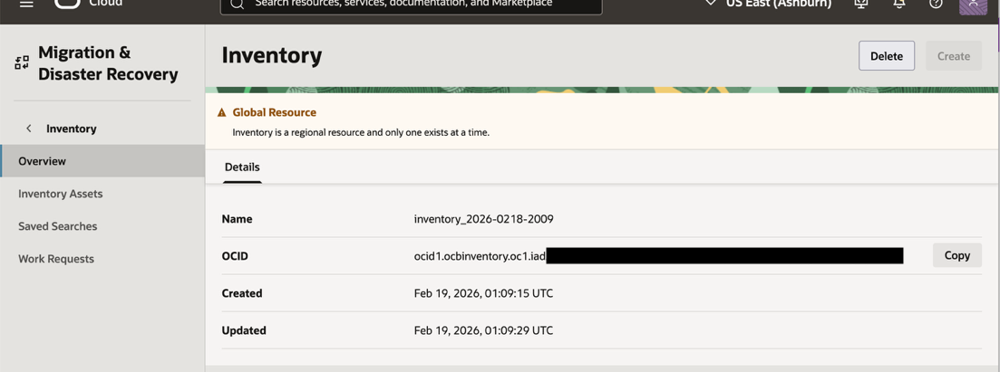

2. Accept the defaults and click **Create**. The inventory provisions in a few seconds.

#### Create the AWS Asset Source

1. Go to **Migration & Disaster Recovery → Migrations → Discovery → Asset sources**.
2. Change the compartment picker to **Migration** (you may need to refresh the page after switching).
3. Click **Create asset source**.
4. Select **AWS** as the asset source type.
5. Give the asset source a name — `AWS_Asset_Source` is a reasonable default.
6. Enter your **AWS Account ID** (12 digits, or in the `XXXX-XXXX-XXXX` format as shown in the AWS console top-right menu).

   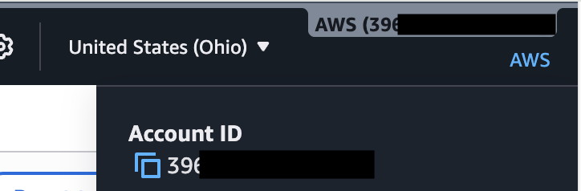

7. Pick the **Region** where your AWS workloads live (e.g. `us-east-1`, `us-east-2`, `us-west-2`). This is an **immutable attribute** — you cannot change it after the asset source is created, so get it right the first time.

   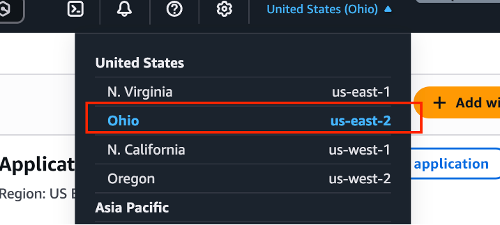

8. Set both **Compartment** (where the asset source lives) and **Target compartment** (where the discovered inventory is written) to **Migration**.

   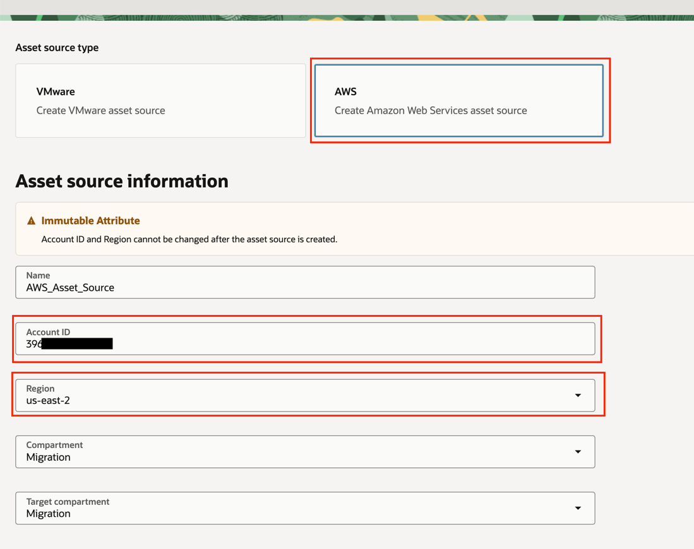

#### Configure Remote Connections Source Environment

Each asset source needs a named source environment that OCM uses for polling. For a fresh install, create a new one:

1. Under **Remote connections source environment**, choose **Create new**.
2. **Display name:** `AWS_Source_Environment`
3. **Create in compartment:** `Migration`

   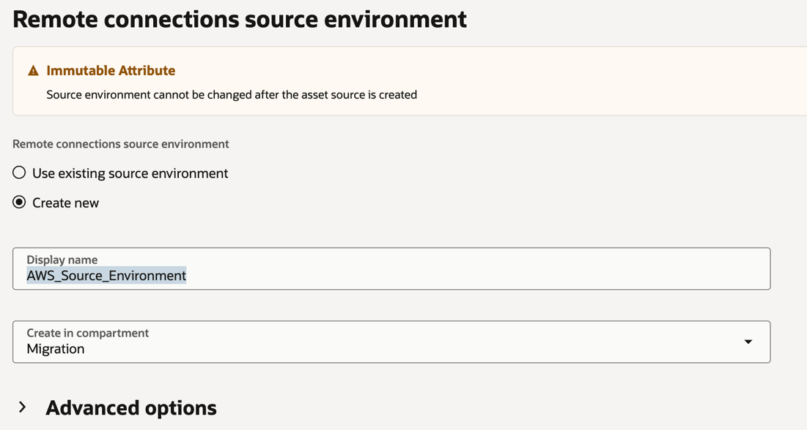

#### Create Discovery Credentials

OCM needs an AWS IAM access key to enumerate your EC2 instances. The key is stored as a Vault secret in the `MigrationSecrets` compartment that the prerequisite stack created.

1. Under **Discovery credentials**, choose **Create secret**.
2. **Name:** `AWS_Discovery_Credentials`
3. **Description:** `AWS Discovery Credentials for OCM`
4. **Vault compartment:** `MigrationSecrets`
5. **Vault:** `ocm-secrets` (auto-created by the prerequisite stack)
6. **Master encryption key:** `ocm-key` (auto-created by the prerequisite stack)
7. **Access key ID** and **Secret access key:** paste the values from your AWS IAM console (see below for where to get them).

   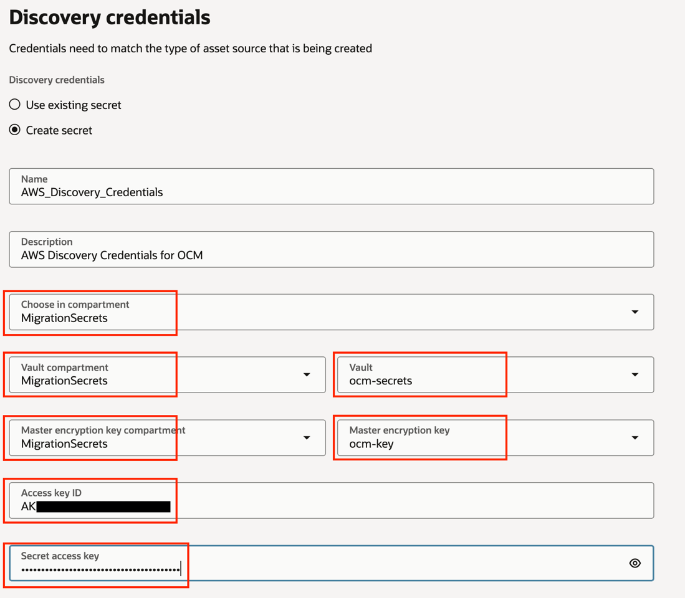

##### Getting the AWS access keys

In the AWS console, click your **account name (top right) → Security credentials**.

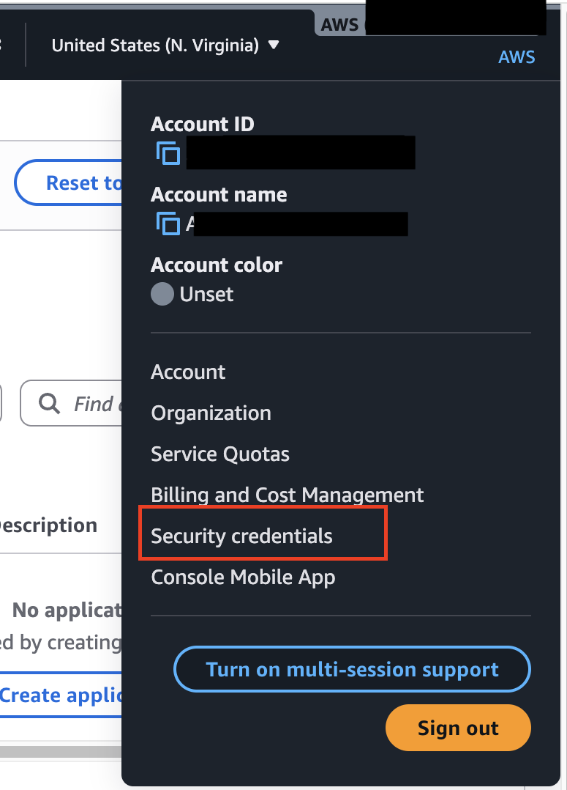

Scroll to **Access keys** and click **Create access key**. Save both the **Access key ID** and the **Secret access key** immediately — the secret is only shown once. Use a dedicated IAM user with read-only EC2 + VPC describe permissions for this, not your root account.

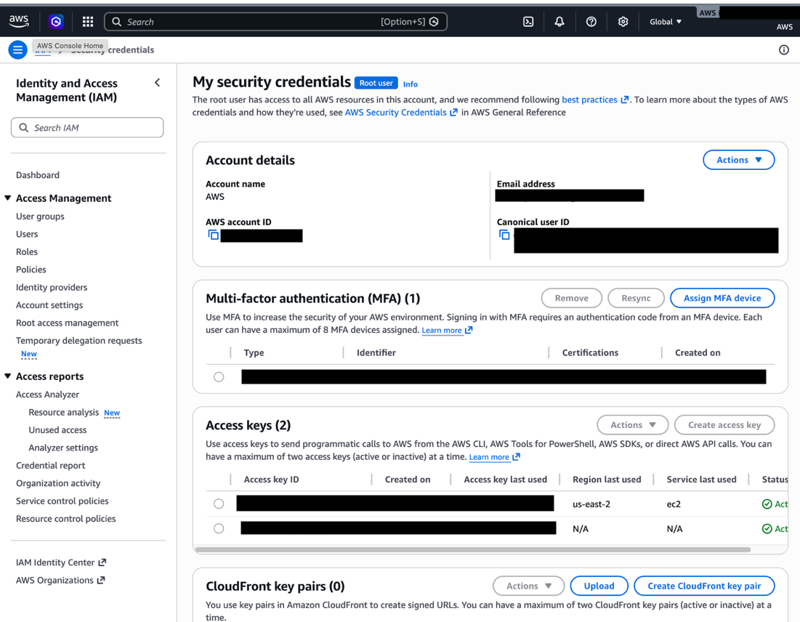

#### Finish the Asset Source Form

1. Under **Replication credentials**, select **Use discovery credentials** — OCM will reuse the AWS access key for both discovery and replication.
2. **Discovery schedules:** leave as **No discovery schedule** for a lab install (ExpressLane triggers discovery on demand), or create a recurring schedule if you want OCM to poll automatically.
3. **Metrics:** leave defaults unless you have a specific opinion.
4. Click **Create asset source**.

   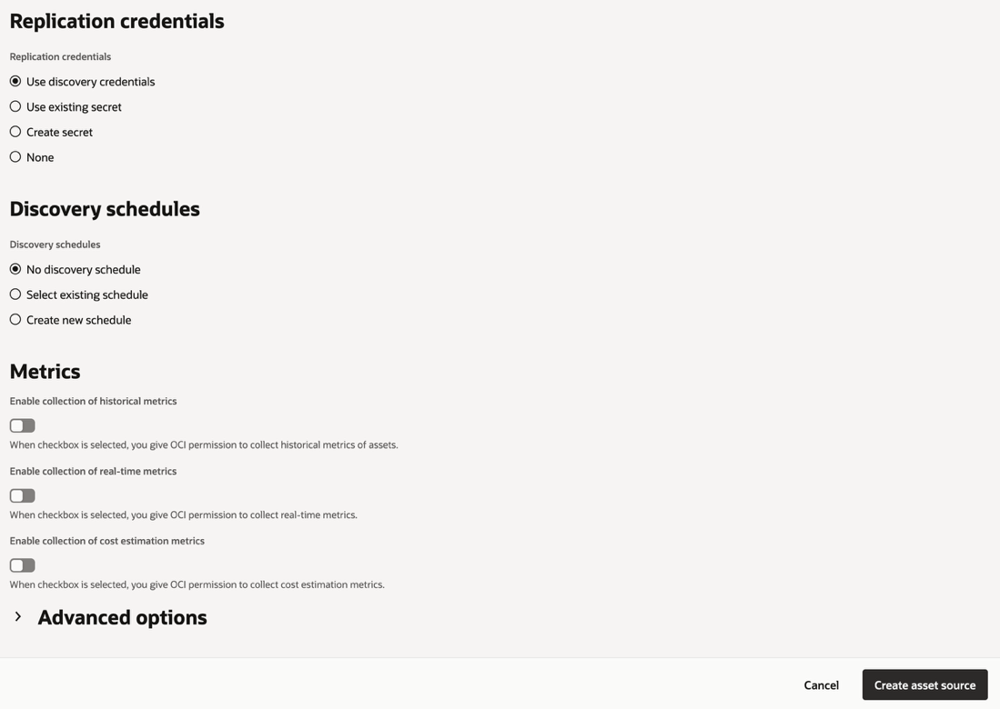

OCM will begin discovering your AWS EC2 inventory. The first discovery pass typically takes 5–15 minutes depending on the size of your AWS account. You can monitor progress from the **Asset sources → (your source) → Work requests** page.

When discovery completes, you'll see your AWS EC2 instances on the **Migration & Disaster Recovery → Migrations → Inventory** page. That's the point at which **ExpressLane's Inventory dashboard will start showing assets** and the migration builder will have VMs to pick from.

---

### A.3 — VMware Source Environments

VMware source environments follow the same pattern as AWS (inventory, asset source, remote connections source environment, discovery credentials) but require additional on-premises infrastructure:

- A **Remote Agent Appliance** (RAA) deployed in the vCenter environment, acting as the bridge between vSphere and OCI.
- **vCenter credentials** with read access to the VMs you want to migrate.
- **Agent Dependencies** — hydration agents installed on the Windows/Linux guests that OCM will replicate.

Because the VMware path involves components that live outside OCI, it's documented in depth on Oracle's official site: <https://docs.oracle.com/en-us/iaas/Content/cloud-migration/home.htm>

From that page, the three sections you need for the VMware-side setup are:

- **Remote Agent Appliances** — how to download, deploy, and register the appliance in vCenter.
- **Source Environments** — how to create a VMware asset source using the RAA as the connector.
- **Agent Dependencies** — which hydration agents to install on Windows vs. Linux guests and how.

Once the VMware asset source is created and has discovered at least one VM, ExpressLane will show those VMs alongside any AWS VMs in the same inventory.

---

## Appendix — Upgrade Check

ExpressLane includes a lightweight, fully open-source **upgrade check** that tells you when a newer release is available. When the app starts, a background thread asks the ExpressLane release endpoint for the latest version number; if yours is older, a dismissible banner appears at the top of every page with a link to the release notes. The check runs once per day (with jitter), never blocks the app, and silently does nothing on any network error.

### Exactly what is sent

Every call is a single HTTPS `GET` with two query parameters and nothing else:

```
GET https://<endpoint>/v1/check?version=1.2.0&install_id=a1b2c3d4
```

| Field        | Value                                                                                    |
|--------------|------------------------------------------------------------------------------------------|
| `version`    | Your installed ExpressLane version string, e.g. `1.2.0`.                                 |
| `install_id` | The **first 8 characters** of a random UUID generated on first run and stored locally.  |

**That's it.** No hostname, no IP, no OCIDs, no tenancy, no compartment, no resource details, no user name, no request body, no cookies. The check never follows HTTP redirects, times out after 3 seconds, and fails silently if the endpoint is unreachable.

The `install_id` file lives at `~/.expresslane/install_id` (file mode `0600`, readable only by the ExpressLane process owner). You can delete it at any time; a new one will be generated on the next run.

The full client implementation is a single file of stdlib Python: [`upgrade_check.py`](upgrade_check.py). It is ~250 lines and designed to be easy to audit.

### Disable the upgrade check

Set `EXPRESSLANE_NO_UPGRADE_CHECK=true` in the environment before ExpressLane starts. When opted out, **no files are written** under `~/.expresslane/`, **no network calls** are made, **no threads are spawned**, and the banner never renders.

**Systemd (Option 1 — VM Manual Install):**

```bash
sudo systemctl edit expresslane.service
# Add the following lines, then save and exit:
#   [Service]
#   Environment="EXPRESSLANE_NO_UPGRADE_CHECK=true"
sudo systemctl restart expresslane.service
```

**Podman / docker-compose (Option 2 — Podman Install):**

```bash
echo 'EXPRESSLANE_NO_UPGRADE_CHECK=true' >> .env
podman-compose up -d --force-recreate
```

You can verify the feature is off by checking that `~/.expresslane/install_id` does **not** exist after starting ExpressLane, and that the navbar shows no upgrade banner.

---

## License

Copyright (c) 2026 Oracle and/or its affiliates.

Released under the Universal Permissive License v1.0 as shown at <https://oss.oracle.com/licenses/upl/>.

---

*ExpressLane — The fast path inside Oracle.*
*Lead Architect: Tim McFadden, Master Principal Cloud Architect (ISV), Oracle ISV Organization.*
